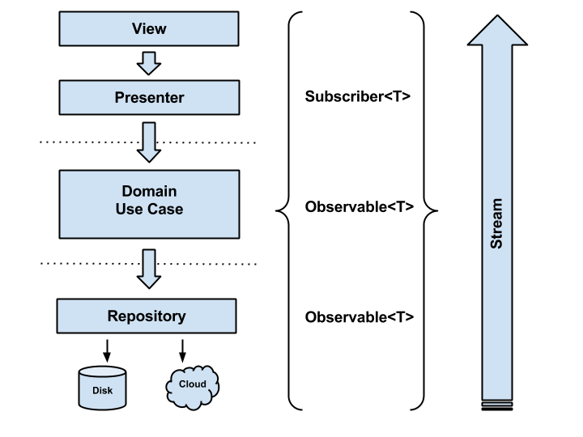
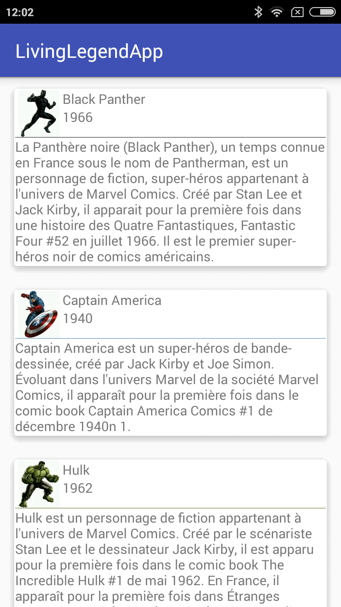
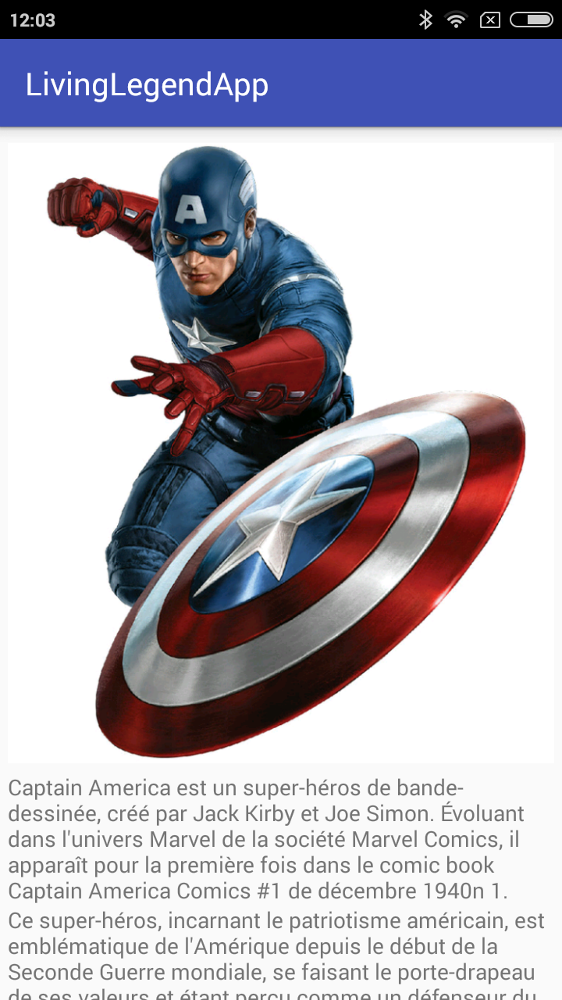

# living-legend-app

This app I use Dagger 2 to inject MVP layers(Model-View-Presenter) into each Activity/Screen of App.

So, Code will be clean, maintainable, and easy to test: which is the three thing each developer have to keep in mind when developing mobile apps.

# App Libraries

In this Project i have used many api which i will not go into details for each library but i will describe each one briefly.

**Leak Canary :**  a Library from Square that analyse the memory of your App and notifiy you whenever a leak happens, it’s easy to set up and it’s really helpful.

**GLide :** Image Loading and caching library very useful for loading images from the net especially for listview whith images from internet.

**Timber :** Another library from Square which allow you customise your log for Debug and release version.

**ButterKnife :** Dependencies Injection library for views into Android Component like Activity/Fragment…

**Retrofit :** Retrofit is one of the most popular HTTP Client Library for Android as a result of its simplicity and its great performance compare to the others.

**RxJava/RxAndroid :** Reactive extension for Java . I highly recommend to use it in each android app because we are reacting to user interactions while a background network thread is running in background and orchestrating all of this quickly become unmanageable code mess. In the Other side this is a case where RxJava (ReactiveX) excels — orchestrating multiple actions that happen due to certain events in the system.

**Retrolambda :** I highly recommend using retrolambda when using RXJava and RXandroid on your project because it reduces the amount of your code ,and your code will be more clear.

# Implementing MVP Core

The project is structured into 5 packages :

**api :** package where the retrofit api reside in .

**application :** package where we put all the generic modules of our app to be used by Activities . So you have to think of the application as it‘s a container of our Activities and it still alive all along the app is running . Also you have to differentiate between Application Context and the Activity Context bacause this is a really important point.

**models :** package where our POJO clas reside.

**ui :** each screen of the app is in separarte package as a child of this parent package.

**utils :** package where rx and network connectivity reside.

# Final Output - Screenshots

Screen 1                          |Screen 2 
:---------------------------------:|:---------------------------------|
|